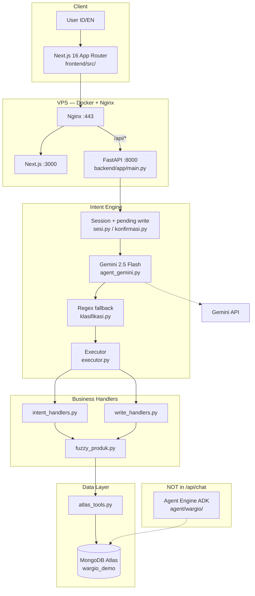

# 02 — Wargio Architecture (Existing Project)

**Repo:** https://github.com/adindamochamad/wargio  
**Live:** https://wargio.adindamochamad.com  
**Lokal analisis:** `/Users/mac/Development/wargio`

---

## 2.1 Konsep Produk

Wargio = AI business assistant untuk **Indonesian micro-retail / warung**.

Shop owner berinteraksi natural language dengan business data:

| Contoh (ID) | Intent |
|-------------|--------|
| "Berapa stok yang hampir habis?" | `restock_alert` |
| "Berapa penjualan minggu ini?" | `sales_report` |
| "Siapa yang masih punya hutang?" | `debt_collection` |
| "Produk mana yang perlu saya restock?" | `restock_alert` |
| "Catat pembayaran Budi Rp50.000." | `record_payment` |

---

## 2.2 Architecture Diagram (Production)



**Critical:** `/api/chat` **tidak** memanggil Agent Engine ADK at runtime. ADK di `agent/wargio/` = deploy terpisah (hackathon/Google Cloud compliance).

---

## 2.3 Agent Flow

```text
User
  ? Natural Language
AI Agent (Gemini classify + regex)
  ? Intent / Reasoning
Tools (atlas_tools: find/aggregate/insert/update)
  ? Business Logic (handlers)
Database (MongoDB Atlas)
  ? Result / Action
Response (templated, not free-form LLM)
```

### Sequence (POST /api/chat)

1. Load/create session (`sesi.py`), save user message
2. Check pending write (`konfirmasi.py`) — if exists, process ya/batal/choice
3. Classify intent: Gemini + regex; **write intents: regex wins**
4. Route to handler (`executor.py`)
5. Handler queries/writes via `atlas_tools`
6. Save assistant message, return `{balasan, intent, classification_mode}`

---

## 2.4 Frontend Structure

| Aspect | Detail |
|--------|--------|
| Framework | Next.js 16 App Router, React 19, TypeScript, Tailwind 4 |
| Entry | `frontend/src/app/page.tsx` |
| Chat | `frontend/src/components/chat/chat-wargio.tsx` |
| Dashboard | `frontend/src/components/dashboard/ringkasan-dashboard.tsx` |
| API | `frontend/src/lib/api.ts` |
| Session | `frontend/src/lib/sesi.ts` — UUID `localStorage` ? `X-Session-Id` |
| i18n | ID/EN via `bahasa-provider.tsx`, `lib/i18n/kamus.ts` |
| Build | `output: "standalone"` |

---

## 2.5 Backend Structure

| Aspect | Detail |
|--------|--------|
| Framework | Python 3.11+, FastAPI, Pydantic v2 |
| Entry | `backend/app/main.py` |
| Config | `backend/app/config.py` |
| Routes | `api/routes/{chat,dashboard,health}.py` |
| DB | `db/koneksi.py` — AsyncMongoClient |
| Rate limit | 30 req/min on chat |

### Services (`backend/app/services/`)

| Module | Role |
|--------|------|
| `executor.py` | Intent ? handler routing |
| `agent_gemini.py` | Gemini classification |
| `klasifikasi.py` | Regex 8 intents |
| `intent_handlers.py` | Read operations |
| `write_handlers.py` | Write + confirmation |
| `atlas_tools.py` | MongoDB MCP-equivalent |
| `fuzzy_produk.py` | Product resolution |
| `embed_produk.py` | Gemini embeddings 768d |
| `konfirmasi.py` | Pending write drafts |
| `sesi.py` | Chat session in MongoDB |
| `dashboard.py` | Dashboard aggregations |
| `ekstrak_entitas.py` | NL entity extraction |
| `transaksi_atomik.py` | MongoDB transactions |
| `mcp_klien.py` | Optional MCP stdio verify |

---

## 2.6 Intent Architecture (8 Intents)

Defined in `klasifikasi.py`, routed in `executor.py`:

| Intent | Handler | Type |
|--------|---------|------|
| `check_stock` | `handle_check_stock` | Read |
| `check_debt` | `handle_check_debt` | Read |
| `restock_alert` | `handle_restock_alert` | Read |
| `sales_report` | `handle_sales_report` | Read |
| `debt_collection` | `handle_debt_collection` | Read |
| `sales_forecast` | `handle_sales_forecast` | Read |
| `record_sale` | `siapkan_record_sale` ? `eksekusi_record_sale` | Write + confirm |
| `record_payment` | `siapkan_record_payment` ? `eksekusi_record_payment` | Write + confirm |

---

## 2.7 Tool Layer

### Production (`atlas_tools.py`)

| Function | MongoDB Op |
|----------|------------|
| `mcp_find` | find |
| `mcp_aggregate` | aggregate |
| `mcp_insert_one` | insertOne |
| `mcp_update_one` | updateOne |

Default: `MCP_LIVE_ENABLED=false` — PyMongo direct, same semantics.

### ADK Agent (`agent/wargio/tools.py`) — separate path

| Tool | Intent |
|------|--------|
| `cek_stok_produk` | check_stock |
| `cek_hutang_customer` | check_debt |
| `daftar_restock_alert` | restock_alert |
| `laporan_penjualan` | sales_report |

---

## 2.8 Database / Data Model

**Database:** `wargio_demo` (env: `MONGODB_DATABASE`)

### Collections

#### `products` (~52 SKUs)

```
sku, name, name_aliases[], name_embedding[768],
category, price_buy, price_sell,
stock_current, stock_minimum, unit, supplier,
last_restock_date, created_at, updated_at
```

#### `customers` (20 seed)

```
name, phone, address, debt_total,
debt_history[]: {amount, description, date, paid, paid_date},
created_at
```

#### `transactions` (~210 seed)

```
type (sale/adjustment), items[], total,
payment_method, customer_id, notes, created_at
```

#### `agent_sessions`

```
session_id, messages[], context.pending_write,
created_at, updated_at
```

**Indexes:** `scripts/buat_indeks.py`  
**Vector index:** `products_vector_index` — 768d cosine on `name_embedding`

**No multi-tenant:** Semua user share satu database, tanpa `warung_id` / `user_id` pada business documents.

---

## 2.9 Authentication

**Tidak ada user authentication.**

| Mechanism | Implementation |
|-----------|----------------|
| Session | Client UUID ? `X-Session-Id` |
| Language | `X-Wargio-Language: id\|en` |
| Rate limit | 30 req/min per session/IP |

`X-API-Key` disebut di `.cursorules.md` tapi **tidak diimplementasi**.

---

## 2.10 LLM Integration

| Use Case | Model | File |
|----------|-------|------|
| Intent classification | gemini-2.5-flash | `agent_gemini.py` |
| Product embeddings | gemini-embedding-001 | `embed_produk.py` |
| ADK agent (unused prod) | gemini-2.5-flash | `agent/wargio/agent.py` |

Gemini **hanya untuk classification + fuzzy matching**. Jawaban bisnis = templated dari handlers, bukan free-form generation.

---

## 2.11 API Endpoints

| Method | Path | Purpose |
|--------|------|---------|
| GET | `/api/health` | Atlas, MCP, Gemini status |
| POST | `/api/chat` | NL chat |
| GET | `/api/dashboard` | Dashboard aggregations |

---

## 2.12 Deployment

| Layer | Tech |
|-------|------|
| Production | VPS + Docker Compose + Nginx + Let's Encrypt |
| Containers | `api` (:8000), `web` (:3010?:3000) |
| Database | MongoDB Atlas M0 external |
| CI | GitHub Actions — `.github/workflows/ci.yml` |

Files: `deploy/docker/docker-compose.yml`, `deploy/nginx/wargio.conf.example`

---

## 2.13 External Dependencies

### Backend (`requirements.txt`)

fastapi, uvicorn, pydantic, pymongo, google-genai, google-adk, mcp, structlog, httpx

### Frontend (`package.json`)

next@16.2.7, react@19, tailwindcss@4, vitest

### Env vars (`.env.example`)

```
MONGODB_URI, MONGODB_DATABASE
GEMINI_API_KEY, GEMINI_MODEL, GEMINI_EMBEDDING_MODEL
GOOGLE_CLOUD_PROJECT, GOOGLE_APPLICATION_CREDENTIALS
AGENT_ENGINE_ID, MCP_LIVE_ENABLED
CORS_ORIGINS, RATE_LIMIT_PER_MINUTE
NEXT_PUBLIC_API_URL
```

---

## 2.14 Security-Sensitive Components

| Area | Risk | Notes |
|------|------|-------|
| Secrets | High | MONGODB_URI, GEMINI_API_KEY |
| No auth | High | Anyone with URL can read/write |
| Single-tenant | High | No isolation |
| PII | Medium | Customer phone, address |
| Session hijack | Medium | Client-controlled UUID |
| Write safety | Mitigated | Confirmation + atomic tx |
| Health endpoint | Low | Exposes config status |

---

## 2.15 Key Takeaway for Anna Integration

1. **Bukan black-box LLM chat** — deterministic handlers + Gemini classifier only
2. **Reuse target:** `intent_handlers`, `write_handlers`, `atlas_tools`, `fuzzy_produk`
3. **Replace target:** FastAPI chat route, Gemini classifier, Next.js UI, session in MongoDB
4. **Skip:** ADK Agent Engine path for Anna Edition
5. **Writes need multi-turn:** confirmation flow must be preserved or redesigned for Anna Agent
