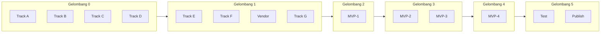

# 07 — Parallel Todolist & Checkpoints

Todolist berbasis **gelombang paralel**. Track dalam gelombang yang sama bisa dikerjakan bersamaan.

---

## Gelombang 0 — Prasyarat (~1 hari)

**Semua paralel, tidak ada dependensi antar track.**

| ID | Track | Task | Output | Status |
|----|-------|------|--------|--------|
| A | Anna env | Node 22, uv, `@anna-ai/cli`, `anna-app doctor`, login, Local Agent default | CLI green | ? |
| B | Scaffold | `anna-app init wargio-anna`, ping/pong harness | Runnable project | ? |
| C | Audit vendor | Checklist modul Wargio + dependency map | [09-vendor-map.md](09-vendor-map.md) validated | ? |
| D | Demo DB | DB `wargio_anna_demo` + seed terpisah | Synthetic data ready | ? |

```text
[A: env]  [B: scaffold]  [C: audit]  [D: demo DB]
              ? CP-0 ?
```

### Checkpoint CP-0

- [ ] `anna-app doctor` no errors
- [ ] `anna-app whoami` shows logged-in account
- [ ] Local Agent set as default
- [ ] Demo DB seeded (not production)

---

## Gelombang 1 — Fondasi (~2–3 hari)

**Butuh CP-0. Empat track paralel.**

| ID | Track | Task | Depends | Output |
|----|-------|------|---------|--------|
| E | Executa shell | `wargio_plugin.py` describe/invoke/health loop | B | stdio server runs |
| F | Manifest | `manifest.json` + `app.json` schema 2 | B | Valid manifest draft |
| C? | Vendor core | Copy `wargio_core/` into executas/wargio/ | C audit | Handlers importable |
| G | UI stub | index.html + app.js placeholder cards | B, F | UI loads in harness |

```text
[E: executa]  [F: manifest]  [C: vendor]  [G: UI stub]
                    ? CP-1 ?
```

### Checkpoint CP-1

- [ ] `anna-app dev` runs without error
- [ ] Executa `describe` returns manifest on stdin test
- [ ] UI iframe loads in harness
- [ ] `wargio_core` imports resolve (even if tools not wired yet)

---

## Gelombang 2 — Vertical Slice (~3–5 hari)

**Sequential — satu tool end-to-end dulu.**

| ID | Task | Paralel? |
|----|------|----------|
| MVP-1 | `get_inventory` tool wired to handlers | ? Priority |
| CHK | Smoke: `#wargio "Produk apa yang hampir habis?"` | After MVP-1 |
| G? | UI card "Stok Kritis" wired | After MVP-1 ? |

### Checkpoint CP-2 (First Success Criterion)

- [ ] User asks Wargio question via `#wargio`
- [ ] Anna Agent calls `get_inventory`
- [ ] Executa queries demo MongoDB
- [ ] Useful formatted answer (ID or EN)

---

## Gelombang 3 — Read Tools MVP (~3–4 hari)

**Paralel setelah CP-2.**

| ID | Task | Handler | Paralel? |
|----|------|---------|----------|
| MVP-2 | `get_sales` | `handle_sales_report` | ? |
| MVP-3 | `get_debts` | `handle_check_debt`, `handle_debt_collection` | ? |
| G? | UI cards omzet + hutang | `tools.invoke` | ? after MVP-2/3 |
| H-partial | Fixtures JSONL for read tools | — | ? |

### Checkpoint CP-3

- [ ] 3 read tools work via Agent
- [ ] Dashboard UI cards refresh from tools
- [ ] Fixtures replay in `anna-app dev`

---

## Gelombang 4 — Write Tool (~3–5 hari)

**Sequential — jangan paralel dengan tool read baru.**

| Step | Task |
|------|------|
| 1 | Design `prepare` / `confirm` API |
| 2 | APS draft storage via reverse-RPC |
| 3 | Wire `siapkan_record_payment` + `eksekusi_record_payment` |
| 4 | Multi-turn test: prepare ? confirm / batal |

### Checkpoint CP-4

- [ ] Payment prepare returns draft summary
- [ ] Confirm writes to demo DB atomically
- [ ] Cancel clears draft without write

---

## Gelombang 5 — Hardening & Publish (~3–5 hari)

**Partially parallel.**

| ID | Track | Task | Paralel? |
|----|-------|------|----------|
| H | Testing | `anna-app validate --strict` | ? |
| H | Testing | Executa standalone smoke script | ? |
| H | Testing | `anna-executa-test` pytest (optional) | ? |
| I | Listing | Logo, screenshots, tagline, privacy URL | ? |
| I | Publish | Publish Executa + submit App Review | After H green |

### Checkpoint CP-5

- [ ] `anna-app validate --strict` passes
- [ ] Listing assets complete
- [ ] App submitted for review

---

## Dependency Diagram



---

## Solo Developer Optimal Order

Jika dikerjakan sendiri, manfaatkan paralelisme saat menunggu:

1. **A + D** bersamaan (env + demo DB)
2. **B** (scaffold)
3. **E + F + C** bersamaan (executa + manifest + vendor)
4. **MVP-1** ? wajib stabil sebelum lanjut
5. **MVP-2 + MVP-3 + G** bersamaan
6. **MVP-4** (write)
7. **H + I** bersamaan

---

## Out of Scope (MVP)

- OmniBridge
- All 8 Wargio intents
- Multi-tenant isolation (Phase 2 post-beta)
- Proxy `/api/chat`
- Production data migration
- Vector search via `llm.embed`
- `record_sale` write tool

---

## Task Tracker IDs

Mapping ke Cursor todo list:

| Todo ID | Gelombang | Track |
|---------|-----------|-------|
| track-a-env | G0 | A |
| track-b-scaffold | G0/G1 | B |
| track-c-vendor | G0/G1 | C |
| track-d-demo-db | G0 | D |
| track-e-executa-shell | G1 | E |
| track-f-manifest | G1 | F |
| track-g-ui-minimal | G1/G3 | G |
| tool-inventory | G2 | MVP-1 |
| tool-sales | G3 | MVP-2 |
| tool-debts | G3 | MVP-3 |
| tool-payment | G4 | MVP-4 |
| track-h-test | G5 | H |
| track-i-publish | G5 | I |
